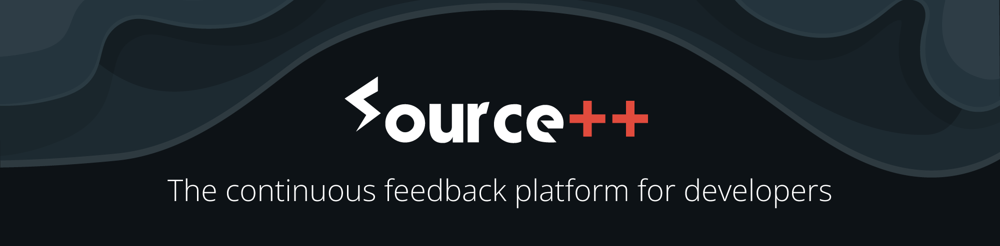

# 

[](LICENSE)

[](https://github.com/sourceplusplus/sourceplusplus/actions/workflows/build.yml)

Source++ is the continuous feedback platform for developers. Add breakpoints, logs, metrics, and distributed tracing to live production software in real-time on-demand, right from your IDE.

Powered by [Apache SkyWalking](https://github.com/apache/skywalking), Source++ enhances the software development experience with production debugging and development capabilities. Become a production-aware developer, understand code faster and deeper with developer-native observability technology, safely debug production applications with negligible to minimal overhead, and gain continuous insight into your application as it behaves in its natural environment.

<table>
    <thead>
    <tr>
        <th width="1000px">
            Live Insight
        </th>
        <th width="1000px">
            Live Instrument
        </th>
    </tr>
    <tr>
        <th width="1000px">
            <kbd>
              
            </kbd>
        </th>
        <th width="1000px">
            <kbd>
              
            </kbd>
        </th>
    </tr>
    </thead>
</table>
<table>
    <thead>
    <tr>
        <th width="1000px">
            Live View
        </th>
        <th width="1000px">
            Live Command
        </th>
    </tr>
    <tr>
        <th width="1000px">
          <kbd>
            
          </kbd>
        </th>
        <th width="1000px">
            <kbd>
              
            </kbd>
        </th>
    </tr>
    </thead>
</table>

### Features

- Live Insights
  - **Function Duration**: Increase/Decrease Prediction
- Live Instruments
  - **Live Breakpoints**: Non-Breaking Breakpoints 
  - **Live Logs**: Just-in-Time Logging
  - **Live Meters**: Real-Time KPI Monitoring
  - **Live Spans**: User-Domain Tracing
- Multi-instance/Serverless debugging
- Role-based access control
- Instrument conditionals
- Instrument TTL, sampling, rate limiting
- Feedback whitelist/blacklist
- PII redaction

## Quickstart

<details>
<summary><b><a href="#"></a> <code>docker</code></b> (macOS/Linux/Windows)</summary>
<br/>
<ol>
<li>Install <a href="https://docs.docker.com/get-docker/">Docker</a> on your system (if not already installed).</li>
<li>Start Live Platform
<pre lang="bash"><code style="white-space: pre-line">docker run -d --name=spp-platform -p 11800:11800 -p 12800:12800 sourceplusplus/spp-platform</code></pre></li>
</ol>
</details>

## Get Started

<!-- - [Get Source++](https://sourceplusplus.com/get/) -->
- Demos
  - [Groovy](https://github.com/sourceplusplus/demo-groovy), [Java](https://github.com/sourceplusplus/demo-java), [Kotlin](https://github.com/sourceplusplus/demo-kotlin)
  - [Node.js](https://github.com/sourceplusplus/demo-nodejs)
  - [Python](https://github.com/sourceplusplus/demo-python)
- Probes
  - [JVM](https://github.com/sourceplusplus/probe-jvm)
  - [Node.js](https://github.com/sourceplusplus/probe-nodejs)
  - [Python](https://github.com/sourceplusplus/probe-python)
- Interfaces
  - [JetBrains Plugin](https://github.com/sourceplusplus/interface-jetbrains)
  - [CLI](https://github.com/sourceplusplus/interface-cli)

## Compiling Project

Follow this [document](https://github.com/sourceplusplus/documentation/blob/master/docs/contributing/How-to-build.md).

## Documentation

The Source++ documentation is available [here](https://docs.sourceplus.plus).

## Directory Structure
```graphql
├── demos                     # Feature demonstrations
    ├── groovy                # Groovy demo
    ├── java                  # Java demo
    ├── kotlin                # Kotlin demo
    ├── nodejs                # Node.js demo
    └── python                # Python demo
├── docker                    # Docker setup files
    ├── e2e                   # End-to-end testing environment
    └── spp-platform          # Live coding server image
├── documentation             # Live coding documentation
├── interfaces                # Live coding clients
    ├── cli                   # Command-line interface
    └── jetbrains             # JetBrains IDE plugin
├── platform                  # Live coding server
    ├── bridge                # Bridge clients to platform
    ├── common                # Common platform code
    ├── core                  # Core platform code
    ├── processor             # Observability data processors
        ├── live-instrument   # Live Instrument processor
        └── live-view         # Live View processor
    └── storage               # Platform persistent memory
├── probes                    # Live coding probes
    ├── jvm                   # JVM support
    ├── nodejs                # Node.js support
    └── python                # Python support
└── protocol                  # Communication protocol
```

## License

This program is free software: you can redistribute it and/or modify it under the terms of the GNU Affero General Public License as published by the Free Software Foundation, either version 3 of the License, or (at your option) any later version. Please see the [LICENSE](LICENSE) file in our repository for the full text.
